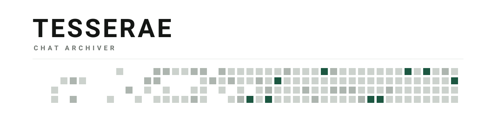

<picture>
  <source media="(prefers-color-scheme: dark)" srcset="banner-dark.svg">
  
</picture>

[English](../README.md) · [日本語](README.ja.md) · [Français](README.fr.md) · [한국어](README.ko.md) · [Português (BR)](README.pt-BR.md) · [简体中文](README.zh-CN.md) · [Deutsch](README.de.md) · [Italiano](README.it.md) · [Español](README.es.md)

> **本译文仅供参考。**以[英文 README](../README.md) 为准。

将 AI 对话导出为 Markdown 和纯文本的 Chrome 扩展。可导出单个对话，也可将整个账户打包为 ZIP。

- Claude 和 ChatGPT 直接从站点自身接口读取完整记录
- 整个账户备份为一个 ZIP，按项目分组
- 支持七种服务，其余使用结构识别
- Markdown 与纯文本，可同时或单独导出
- 可选导出编辑或重新生成时舍弃的回复
- 界面支持九种语言

Manifest V3。无依赖、无构建步骤、无服务器、无遥测。

## 快速开始

1. 在 [Releases](../../../releases) 下载 ZIP 并解压
2. 打开 `chrome://extensions`，开启**开发者模式**
3. 点击**加载已解压的扩展程序**，选择解压后的文件夹
4. 在受支持的站点打开对话，点击工具栏中的扩展图标，再点**导出对话**

文件会保存到下载目录。整个流程就是这样。

请不要移动或删除解压后的文件夹：Chrome 通过路径识别已解压的扩展程序。如果你克隆了仓库，第 3 步请选择 `extension/`。

两种格式默认都已勾选。取消其中一个，就只会导出另一个。

勾选**被舍弃的回复**可一并导出编辑或重新生成时舍弃的分支。仅 Claude 和 ChatGPT。

**整个账户**：点击**备份全部对话**。会打开一个标签页并写入单个 ZIP：每个对话一个文件、一份索引，属于 Claude 项目的对话归入以项目名命名的文件夹。

文件名以日期开头。同名对话会编号而非覆盖。失败的对话记录在 `_errors.txt` 中，不会中断整个任务。请求速率约为每秒一次。

## 动机

多数导出工具靠滚动页面读取 DOM。Claude 用虚拟列表渲染长对话，屏幕外的消息会被移出 DOM，导出结果因此被悄悄截断。

本扩展在站点提供记录接口时直接读取，否则退回滚动方式，并在导出的文件中注明所用方式。

## 支持情况

| 站点 | 方式 | 批量 |
|---|---|---|
| claude.ai | 记录接口 | 支持 |
| chatgpt.com | 记录接口 | 支持 |
| gemini.google.com | DOM，`<infinite-scroller>` | 不支持 |
| grok.com | DOM，`.message-bubble` | 不支持 |
| chat.deepseek.com | DOM，`.ds-markdown` + 结构识别 | 不支持 |
| copilot.microsoft.com | DOM，`[data-content]` | 不支持 |
| chat.mistral.ai | 仅结构识别 | 不支持 |
| 其他 | 结构识别 | 不支持 |

批量备份需要能列出全部对话的接口，只有 Claude 和 ChatGPT 公开了这类接口。如需完整的 Gemini 存档，请使用 Google Takeout。

## 语言

界面提供九种语言，默认跟随 Chrome 的显示语言，也可在每个页面底部切换。

## 限制

- 批量备份仅支持 Claude 和 ChatGPT。
- 所用接口未公开，可能随时变动。若导出内容不全，可点击弹窗中的**原因**查看诊断信息。
- Grok、DeepSeek、Copilot 和 Le Chat 的选择器来自公开资料，未在真实账户上验证。

## 许可协议

MIT. Copyright (c) 2026 Lavelle Hatcher Jr.

与上述任何服务均无隶属关系，也未获其背书。
